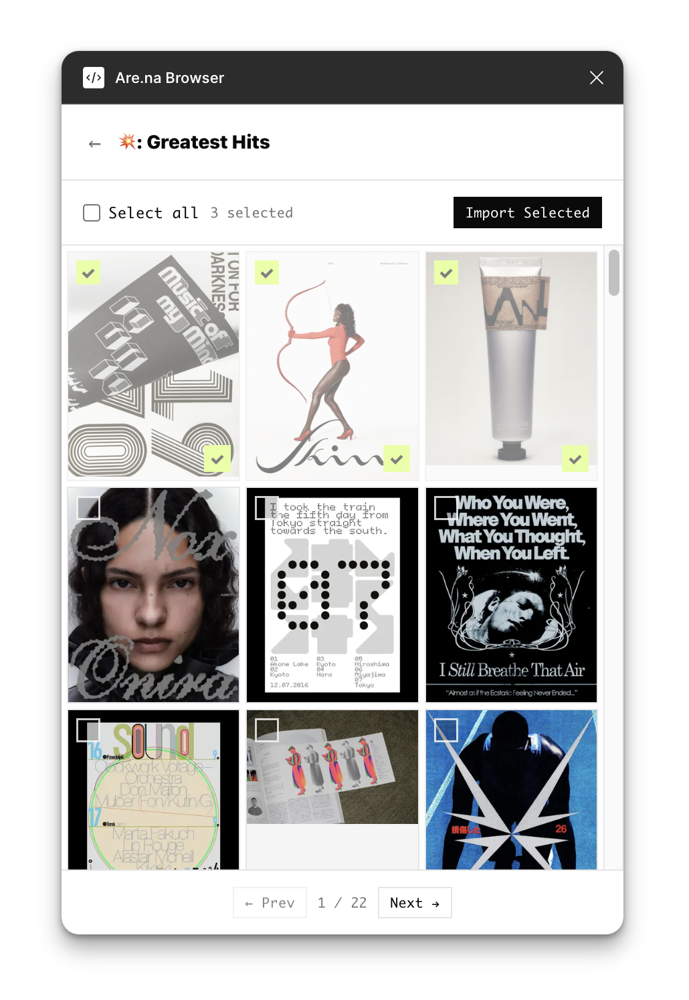

# Are.na Browser for Figma



A Figma plugin for browsing your Are.na channels and groups, importing images individually or in batch, with visual tracking of what's already been imported.

## Features

- **Browse your channels** — connects to the Are.na API using your personal access token
- **Group support** — enter a group slug to browse group channels, with saved groups for quick access
- **Batch import** — select multiple images and import them all at once, laid out in a grid on your canvas
- **Import tracking** — imported images are marked at 50% opacity so you can see what's already been brought in (tracked per document)
- **Sorted by recent** — channels and images are sorted by most recently updated

## Setup

1. Clone the repo and install dependencies:

```
git clone https://github.com/brianokarski/arena-figma-plugin.git
cd arena-figma-plugin
npm install
npm run build
```

2. In Figma, go to **Plugins → Development → Import plugin from manifest** and select the `manifest.json` file.

3. Generate a personal access token at [are.na/settings/personal-access-tokens](https://are.na/settings/personal-access-tokens).

4. Open the plugin, enter your Are.na username (the slug from your profile URL) and paste your token.

## Development

```
npm run watch
```

This will rebuild automatically when you change `src/code.ts`. Changes to `src/ui.html` are picked up on plugin reload.
